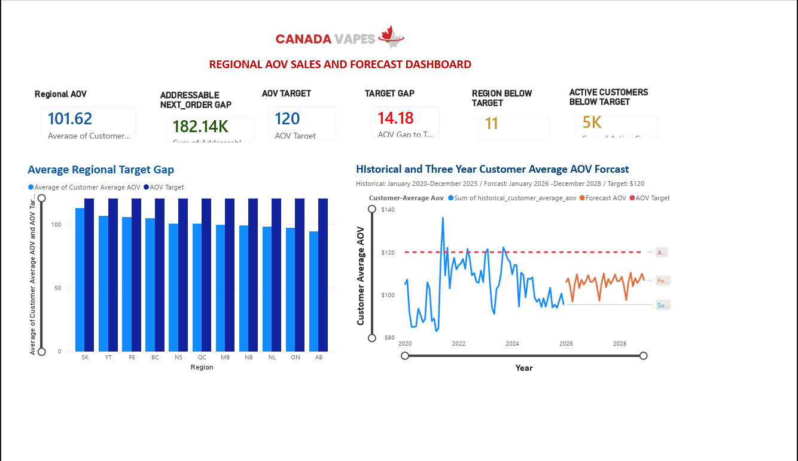
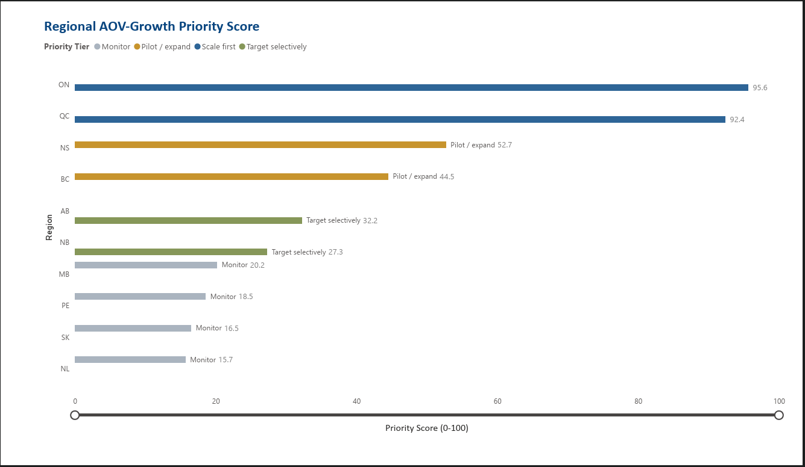
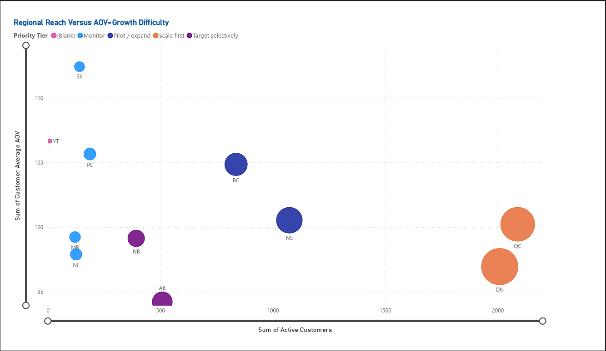

# Canada Vapes — Data Analytics Capstone

## Executive Summary

This capstone transformed Canada Vapes sales and customer data into business-focused insights about sales growth, customer value, regional opportunity, and Average Order Value (AOV).

The team used Python/pandas for data preparation, validation, KPI calculation, segmentation, and forecast checks, and Power BI for dashboarding and business storytelling. The final analysis validated **177,142 completed positive-value orders**, **$18.17M in completed net sales**, **22,569 identifiable customers**, and a **weighted order-level AOV of $102.59**. The supplied forecast reaches approximately **$8.0M in net sales by 2028**.

> **Privacy / Client Note:** The original Canada Vapes transaction and forecast datasets are not included in this public repository. The project report identifies these as unpublished internal datasets. Portfolio visuals and findings are presented in aggregated form.

## Business Problem

The project was designed to move from performance reporting toward practical management decisions. It examined sales and AOV trends, customer value, regional opportunity, progress toward the **$120 AOV target**, and privacy/governance controls required before recommendations are operationalized.

## My Role — Visualization & QA Lead

My documented team role was **Visualization & QA Lead**.

Responsibilities included:
- Assessing data quality
- Developing the Power BI dashboard prototype
- Creating charts and visualizations
- Supporting dashboard development
- Coordinating quality-assurance reviews
- Assisting with report formatting
- Developing presentation materials

## Key Skills & Tools

| Skill / Tool | Evidence |
|---|---|
| **Python / pandas** | [Final Report](report/Canada_Vapes_Final_Report.pdf) |
| **Power BI** | [Dashboard](dashboard/) |
| **Data Cleaning & ETL** | [Data Prep & Ethics](documentation/Data%20Prep%20%26%20Ethics.docx) |
| **Data Quality & QA** | [Blocker & Solution](documentation/Blocker%20%26%20Solution.docx) and [Final Report](report/Canada_Vapes_Final_Report.pdf) |
| **Data Visualization** | [Dashboard](dashboard/) |
| **Data Storytelling** | [Final Presentation](presentation/Canada_Vapes_Final_Presentation.pdf) |
| **Business Analytics** | [Final Report](report/Canada_Vapes_Final_Report.pdf) |
| **Ethics & Governance** | [Data Prep & Ethics](documentation/Data%20Prep%20%26%20Ethics.docx) |

SQL and Excel were identified as supporting tools in the project methodology, but separate SQL/Excel source files are not included in this public repository.

## Project Highlights

- Validated **177,142 completed positive-value orders** representing **$18.17M in completed net sales**.
- Identified a **57.2% repeat-customer rate**; returning-customer order AOV was **$112.96** versus **$75.50** for new customers.
- Identified an AOV gap against the **$120 target** and a metric-definition issue caused by different analytical grains.
- Developed Power BI visuals for regional AOV, forecast performance, regional priority, customer reach, and AOV-growth difficulty.
- Recommended piloting proven tactics in Nova Scotia and British Columbia, scaling proven tactics in Ontario and Quebec, selectively targeting Alberta and New Brunswick, and monitoring smaller regions until sample sizes were more reliable.

## Analytical Workflow

1. Loaded **181,641 transaction rows** and standardized dates and numeric fields.
2. Retained completed positive-value purchases, producing **177,142 valid orders**.
3. Calculated net sales, AOV, items/order, coupon rate, customer type, annual sales, and purchase frequency.
4. Built descriptive customer planning segments.
5. Aggregated the monthly forecast into annual orders and net sales.
6. Compared Python, Power BI, and project-report outputs for metric differences and QA.
7. Used Power BI to communicate KPIs, trends, forecasts, regional priorities, and recommendations.

## Power BI Dashboard

### Regional AOV Sales & Forecast



### Regional AOV-Growth Priority Score



### Regional Reach Versus AOV-Growth Difficulty



See the [full dashboard preview](dashboard/Dashboard%20preview.pdf).

## Data Quality & QA

A key QA issue was that AOV values differed across analytical grains:

- **$102.59** — weighted completed-order AOV from Python
- **$101.84** — executive Power BI dashboard AOV
- **$101.62** — regional dashboard AOV
- **$100.50** — mean customer-level AOV
- **$84.73** — median customer-level AOV

The project recommended a governed metric dictionary, explicit analytical-grain definitions, and reconciliation between Power BI and Python outputs.

## Ethics, Privacy & Governance

The project addressed confidentiality, purpose limitation, data minimization, secure storage, aggregated reporting, data lineage, regional/sample-size limitations, age-eligibility checks, responsible marketing, and avoiding unsupported ROI or profit claims.

## Key Limitations

- The transaction dataset did not contain a region field.
- Product descriptions were not fully standardized.
- Product/campaign costs and profit-margin information were unavailable.
- Forecast model metadata and accuracy measures were unavailable.
- Historical customer segments were descriptive rather than predictive.
- Age-eligibility information was not present in the analytical dataset.

## Recommendations

The project recommended:
1. Establishing one governed AOV and growth scorecard.
2. Protecting high-value customers and improving first-to-second purchase conversion.
3. Testing bundles, premium alternatives, and minimum-spend thresholds rather than relying broadly on discounts.
4. Piloting regional tactics before scaling.
5. Adding cost and margin information before making profit or ROI claims.
6. Maintaining privacy, age-eligibility, responsible-marketing, and audit controls.

## Repository Structure

```text
canada-vapes-capstone/
│
├── README.md
│
├── dashboard/
│   ├── README.md
│   ├── Dashboard preview.pdf
│   ├── regional-aov-sales-forecast.png
│   ├── regional-priority-score.png
│   └── regional-reach-vs-aov-difficulty.png
│
├── documentation/
│   ├── README.md
│   ├── Blocker & Solution.docx
│   ├── Data Prep & Ethics.docx
│   └── Project_Plan.pdf
│
├── report/
│   └── Canada_Vapes_Final_Report.pdf
│
└── presentation/
    ├── README.md
    └── Canada_Vapes_Final_Presentation.pdf
```

### How to Navigate

- **Dashboard:** View the Power BI visuals and full dashboard preview.
- **Documentation:** Review project planning, data preparation/ethics, and project blockers/solutions.
- **Report:** Read the complete methodology, findings, limitations, QA, and recommendations.
- **Presentation:** Review the stakeholder-facing final presentation.

## Portfolio Takeaway

This project demonstrates an end-to-end analytics workflow from business problem definition and data preparation through KPI validation, visualization, quality assurance, business storytelling, and responsible analytics.

My primary contribution was at the **Visualization & QA** stage, where I helped turn analytical outputs into decision-oriented Power BI visuals and supported quality checks across project deliverables.

